# Project Sentinel — Future Roadmap & Rollout Strategy

This document consolidates every "Phased Rollout" and roadmap section across all v2 specifications (01–10) into a single, dependency-based sequence. 

---

## 1. Consolidated Phase Plan

Phases are scoped by **dependency**, not by calendar time. A milestone starts when its prerequisites from earlier milestones are completed.

```mermaid
graph TD
    subgraph Phase 0: Foundation
        P0_1["1. Catalyst Questions (08 §3)"]
        P0_2["2. Staging/Prod Setup (10 §1)"]
        P0_3["3. Case CRUD & UI State (09 §1-2)"]
        P0_4["4. Knowledge Graph Schema (04 §7)"]
        P0_5["5. Case-Scoped RAG Parity (05 §6)"]
        P0_6["6. Provider Scaffolding (07 §6)"]
        P0_7["7. Core Agent & Router (03 §7)"]
        P0_8["8. Board UI (Drag/Connect) (09 §7)"]
    end

    subgraph Phase 1: Intelligence Layer
        P1_1["1. Full API Integrations (07 §6)"]
        P1_2["2. Specialized Agents (03 §7)"]
        P1_3["3. Research Action (09 §4)"]
        P1_4["4. Hypotheses & Timelines (09 §7)"]
        P1_5["5. Batch Dataset Migrations (06 §5)"]
        P1_6["6. GeoJSON/KML/Shapefile Ingestion (06 §5)"]
        P1_7["7. Catalyst Storage & Cache (08 §4)"]
        P1_8["8. CI/CD Staging Gate (10 §6)"]
    end

    subgraph Phase 2: Scale & Polish
        P2_1["1. ML Financial & Forecast (03 §7)"]
        P2_2["2. Multi-Provider Verification (03 §7)"]
        P2_3["3. Audio/Video Transcription (06 §5)"]
        P2_4["4. Multi-Ontology Engine (04 §7)"]
        P2_5["5. Cross-Case Entity Resolution (04 §7)"]
        P2_6["6. Auth/RBAC & Multi-Org (00 §6)"]
        P2_7["7. 3D Earth Globe View (00 §6)"]
        P2_8["8. Rollbacks & Cost Alerts (10 §6)"]
        P2_9["9. Re-Evaluate Vector Index (01 §4)"]
        P2_10["10. Re-Evaluate Graph DB (01 §5)"]
    end

    P0_1 --> P1_7
    P0_2 --> P1_8
    P0_3 --> P1_3
    P0_4 --> P1_4
    P0_5 --> P1_5
    P0_6 --> P1_1
    P0_7 --> P1_2
    P0_8 --> P1_3

    P1_1 --> P2_2
    P1_2 --> P2_1
    P1_3 --> P2_5
    P1_4 --> P2_7
    P1_5 --> P2_4
    P1_6 --> P2_3
    P1_7 --> P2_6
    P1_8 --> P2_8
```

### Phase 0 — Foundation
*   **AppSail Compatibility Checks:** Resolve WebSocket connection availability, Object Store naming, and Catalyst Auth/RBAC structures (`08_Catalyst_Architecture.md` §3).
*   **Staging & Production Provisioning:** Formalize environments inside `.catalystrc` (`10_Deployment.md` §1).
*   **Case Persistence:** Create endpoints for case CRUD and `ui_state` persistence (`09_Investigation_Workspace.md` §1–2).
*   **Core Knowledge Graph:** Build the core schema and ontology enforcement engine with manual entity/relationship updates (`04_Knowledge_Graph.md` §7).
*   **In-Memory RAG Engine:** Achieve local v1 vector database parity, serving documents in-memory per-case (`05_RAG_System.md` §6).
*   **Provider Scaffolding:** Establish connection and capability mappings targeting Groq and Hugging Face APIs (`07_API_Integrations.md` §6).
*   **Base Planner Agent:** Set up the main Planner, RAG Agent, and AI router (`03_Agent_System.md` §7).
*   **Interactive Canvas:** Introduce the Connections Board with drag, drop, and connection capabilities (`09_Investigation_Workspace.md` §7).

### Phase 1 — Intelligence Layer
*   **Expanded Integrations:** Wire NASA, Mapillary, Google Maps, Indian Kanoon, Firecrawl, and Tavily APIs (`07_API_Integrations.md` §6).
*   **Specialized Agents:** Instantiate OSINT, Geospatial, Legal, Verification, Timeline, Memory, and Citation sub-agents (`03_Agent_System.md` §7).
*   **Auto-Research Actions:** Wire the canvas "Research" button to prompt the Agent Planner for subtask planning (`09_Investigation_Workspace.md` §4).
*   **Hypotheses & Chronologies:** Integrate hypotheses linking, spatiotemporal chronology updates, and network graphs (`09_Investigation_Workspace.md` §7).
*   **Dataset Migrations:** Execute the 15+ flat dataset batch migrations to graph tables (`06_Data_Ingestion.md` §5).
*   **Ingestion Pipeline Extensions:** Support GeoJSON/KML/Shapefile parsing and OCR extraction (`06_Data_Ingestion.md` §5).
*   **Catalyst Storage Infrastructure:** Fully connect Object Store, Cache, and background Job scheduling (`08_Catalyst_Architecture.md` §4).
*   **Pipeline Automation:** Enforce CI/CD linting, unit tests, and multi-stage branch gating (`10_Deployment.md` §6).

### Phase 2 — Scale & Polish
*   **Machine Learning Integration:** Wire the Financial Intelligence & Forecast agents to the platform's core Scikit-Learn/XGBoost models (`03_Agent_System.md` §7).
*   **Multi-Provider Verification:** Establish cross-agent consensus models (`03_Agent_System.md` §7).
*   **Multimedia Processing:** Add audio/video transcription handlers to the ingestion pipeline (`06_Data_Ingestion.md` §5).
*   **Multi-Ontology Engine:** Generalize graph modeling schemas for disaster response and custom verticals (`04_Knowledge_Graph.md` §7).
*   **Entity Resolution:** Build cross-case duplicate entity scanning and linkage controls (`04_Knowledge_Graph.md` §7).
*   **Auth & Permissions:** Add full Authentication/RBAC and multi-organization resource sharing (`00_Vision.md` §6).
*   **3D Geospatial Visuals:** Render spatiotemporal chronologies over a 3D Earth Globe view (`09_Investigation_Workspace.md`).
*   **Resilience & Monitoring:** Deploy automated cost/quota warnings and build rollback tools (`10_Deployment.md` §6).
*   **Index Re-Evaluation:** Verify NumPy cache performance; benchmark dedicated vector databases if any case exceeds **20,000 chunks** (`01_System_Architecture.md` §4).
*   **Graph Re-Evaluation:** Benchmark Data Store adjacency table lookups; transition to dedicated graph databases if any case exceeds **50,000 nodes** (`01_System_Architecture.md` §5).

### Out-of-Scope (Through Phase 2)
*   **Face Recognition:** Deferred pending legal, ethical, and dedicated spatiotemporal vision pipeline review (`00_Vision.md` §6).
*   **Native Mobile Apps:** Excluded; focus is strictly on responsive, high-performance web client architectures (`00_Vision.md` §6).
*   **Multi-Tenant Org Isolation:** Multi-tenant hard isolation schemas are deferred to Phase 3 (`00_Vision.md` §6).

---

## 2. Core Decisions Matrix

The following 7 decisions require a human call and cannot be resolved unilaterally:

| # | Decision Area | Operational Context | Reference |
|---|---|---|---|
| **1** | **Vision/OCR Provider** | Choose OCR provider (e.g. Google Cloud Vision API, AWS Rekognition, or local Tesseract container) and align on cost tier. | `07_API_Integrations.md` §4.1.1 |
| **2** | **Secondary LLM Provider** | Select secondary completion API (e.g. Gemini, OpenAI, or local Llama via Ollama) to support Verification Agent redundancy. | `07_API_Integrations.md` §4.1.4 |
| **3** | **Demographics Licensing** | Select a licensed source for regional population metrics since Worldometers lacks public API integrations. | `07_API_Integrations.md` §4 |
| **4** | **Government Scraping** | Establish Firecrawl/Tavily scraping intervals for CERT-IN, PIB, and RBI vs. using dedicated API integrations. | `07_API_Integrations.md` §4.1.2 |
| **5** | **Vector Scale Path** | Stay on the per-case NumPy cache or transition to a managed vector DB (e.g. Pgvector, Pinecone, or Qdrant) at **20K chunks/case**. | `01_System_Architecture.md` §4 |
| **6** | **Graph Scale Path** | Stay on the Catalyst Data Store adjacency index or migrate to a native graph DB (e.g. Neo4j or Amazon Neptune) at **50K nodes/case**. | `01_System_Architecture.md` §5 |
| **7** | **WebSockets on AppSail** | Confirm AppSail's raw WebSocket persistent connection limits or fallback to SSE (Server-Sent Events) for real-time agent logging. | `08_Catalyst_Architecture.md` §3 |

---

## 3. Long-Term Vision (Phase 3+)

The core engine of Project Sentinel (Case $\rightarrow$ Entities $\rightarrow$ Evidence $\rightarrow$ Graph $\rightarrow$ Agents) is entirely **domain-agnostic**.

Once Phase 2 proves the architecture in the crime-analysis vertical, the exact same system can easily support other fields by:
1. **Defining New Ontologies:** Swapping the crime-analysis JSON ontology for a disaster-response, financial-fraud, or supply-chain schema.
2. **Developing Domain Plugins:** Introducing specialized APIs (e.g., FEMA disaster feeds, supply chain logistics databases) to the AI Router.
3. **Prompt Adaptation:** Aligning the Planner Agent and sub-agents to utilize the new entity classes and search fields.
