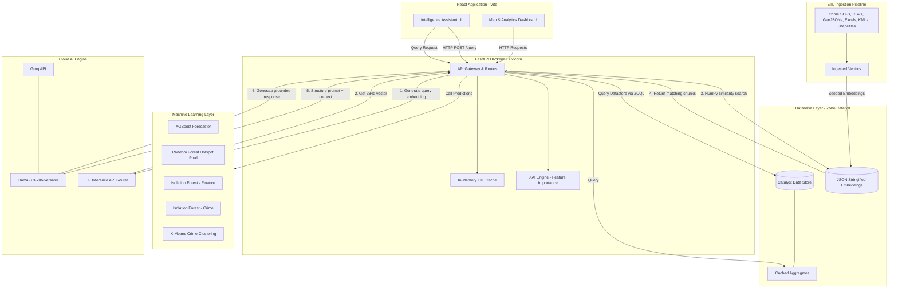

# 02 — System Architecture

This document maps out the end-to-end system architecture of Project Sentinel, showing the relationships between the frontend, API, database, machine learning pipelines, and the Retrieval-Augmented Generation (RAG) assistant.

## Architecture Overview

## Component Breakdown

### 1. Presentation Layer (React + Vite)
- **Design Language**: Premium, dark monochrome aesthetic (`#0A0A0A` background, pure shades of gray, white, and subtle red alerts).
- **Core Views**:
  - **Crime Heatmap**: Uses Leaflet/Mapbox with dynamic coordinate bounding boxes for 1km² spatial crime density mapping.
  - **Forecasting & Hotspots**: Displays future projections and high-risk zones.
  - **Network / Link Analysis**: Visualizes transaction networks and suspect communications.
  - **Intelligence Assistant**: Interactive command-line-style RAG terminal.

### 2. Application Layer (FastAPI on AppSail)
- **FastAPI / Uvicorn**: Serves as the web server, running on port `9000` (AppSail production) and `8000` (development).
- **In-Memory TTL Cache**: Caches high-latency endpoints (e.g. `network/stats`, `network/fraud-graph`, `ai/anomalies`) with a 5-minute expiration, keeping dashboard latencies under 500ms.
- **Explainable AI (XAI)**: Replaces simple heuristics with actual model weights and feature importances (`feature_importances_` from XGBoost/Random Forest).

### 3. Data & Storage Layer (Zoho Catalyst Data Store)
- **Relational Tables**: Manages dimension tables (`dim_police_units`, `dim_geography`, etc.) and fact tables (`fact_fir_events`, `fact_financial_transactions`) directly inside Zoho Catalyst Data Store.
- **ZCQL Engine**: Provides robust SQL querying capabilities for relational mapping, aggregations, and district timelines.
- **Embedding Storage**: Stores document embeddings (`VARCHAR(4000)`) as stringified JSON lists in the `rag_document_embeddings` table. Cosine similarity operations are performed in memory using NumPy.
- **Seeded Datasets**: Ingests high-performance subsets of FIR events (20,000 rows), financial accounts (20,000 rows), and phone calling records (33,876 rows) to respect Zoho sandbox platform size thresholds.

### 4. Cloud AI & Embedding Engine (Groq + HF Serverless Inference API)
- **Embedding Generation**: Serverless Hugging Face `all-MiniLM-L6-v2` model endpoint generates 384-dimensional dense vectors from search query text.
- **Text Generation**: Runs `llama-3.3-70b-versatile` via Groq Cloud completions. Synthesizes answers strictly using retrieved chunks and returns grounded responses with citations.
- **Fallback Engine**: Gracefully degrades to retrieval-only mode if the cloud LLM provider is unreachable.

## Related Notes
- [[03_Database_Schema]]
- [[08_Frontend_Architecture]]
- [[09_RAG_System]]
- [[10_Deployment_Guide]]
- [[13_Performance_Report]]
