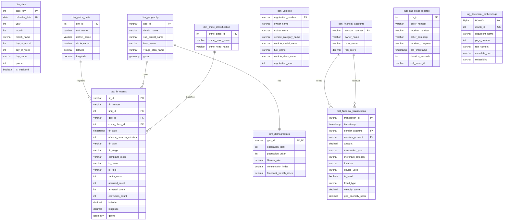

# 03 — Database Schema

This document details the database architecture of Project Sentinel, including the Entity-Relationship Diagram (ERD), tables, indexes, and materialized views used to support high-performance analytical queries.

## Entity-Relationship Diagram (ERD)

## Tables & Counts

The database is built on the cloud-based **Zoho Catalyst Data Store** using Zoho Catalyst Query Language (ZCQL) for analytical access. Vector operations are processed programmatically in-memory via NumPy to fit within AppSail runtime constraints, and spatial calculations are executed using custom spherical geometry modules.

| Table Name | Type | Row Count | Primary Key | Description |
|---|---|---|---|---|
| `dim_date` | Dimension | 6,209 | `ROWID` | Date dimension mapping calendars from 2010 to 2026. |
| `district_centroids` | Dimension | 36 | `ROWID` | Centroid coordinates for Karnataka districts to handle fallback geolocations. |
| `dim_police_units` | Dimension | 1,000+ | `ROWID` | Police stations, subdivisions, and their coordinates. |
| `dim_geography` | Dimension | - | `ROWID` | Administrative boundaries and divisions stored as WKT. |
| `dim_demographics` | Dimension | - | `ROWID` | Census 2011 population, literacy, and wealth indexes. |
| `dim_crime_classification`| Dimension | - | `ROWID` | Master list of crime groups and headings (cyber, murder, etc.) |
| `dim_vehicles` | Dimension | - | `ROWID` | Owner and model info for registered vehicles. |
| `dim_financial_accounts` | Dimension | 1,000,000+ | `ROWID` | Bank account numbers and their ML-assigned risk scores. |
| `fact_fir_events` | Fact | 20,000+ | `ROWID` | Primary crime reporting details containing spatial and legal stats. |
| `fact_financial_transactions` | Fact | 11,360,000+ | `ROWID` | Financial records of transactions with computed anomaly metrics. |
| `fact_call_detail_records` | Fact | 33,876 | `ROWID` | Call logs for communications analysis. |
| `rag_document_embeddings` | Fact (AI) | 2,384 | `ROWID` | Chunked documents with stringified 384-dimensional embeddings (loaded to NumPy vector cache). |

---

## Indexing Strategy

To optimize real-time searches across millions of records in Zoho Catalyst Data Store:

### 1. Unique and Field Indexes
- Unique indexes on natural keys (`chunk_id`, `unit_id`, `district_name`, `geo_id`, `fir_id`, `transaction_id`, `cdr_id`, `account_number`).
- Query-filter indexes on high-frequency search fields (`district_name`, `fir_date`, `sender_account`, `receiver_account`, `risk_score`).

### 2. Computational Vector & Spatial Acceleration
- In-memory NumPy hybrid cache mapping `rag_document_embeddings` rows into preloaded floating-point matrices. High-speed vector dot products calculate cosine similarity metrics.
- Mathematical spatial distance filtering within the Python FastAPI AppSail backend layer to find nearby police stations or anomalous financial transaction velocity points without postGIS requirements.

---

## Pre-Aggregated Analytic Tables

We precompute aggregations to avoid slow sequential scans over large datasets:

1. **`mv_district_profile`**: Precomputes overall crime and arrest counts by district.
2. **`mv_monthly_trends`**: Monthly crime volumes by category.
3. **`mv_station_profile`**: Crime volumes, arrests, and primary crime categories by station.
4. **`mv_network_stats`**: High-level network totals (total fraud, total CDR).
5. **`mv_fraud_graph_edges`**: Pre-joined sender and receiver profiles for fraud graph visualizer.
6. **`mv_anomaly_financial`**: Top anomalous financial transactions based on velocity and spatial deviation.

## Related Notes
- [[02_System_Architecture]]
- [[04_ETL_Pipeline]]
- [[05_Datasets]]
- [[13_Performance_Report]]
