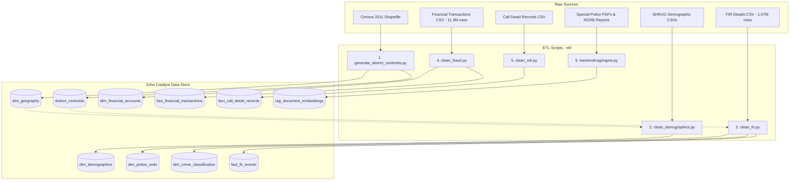

# 04 — ETL Pipeline

This document explains the Data Ingestion and ETL (Extract, Transform, Load) Pipeline of Project Sentinel. The ETL processes raw files (CSV, Shapefiles, KML, and PDFs) and populates the database using a topological ordering to satisfy foreign key constraints.

## Ingestion Architecture



---

## Ingestion Order & Details

The ETL is coordinated by [run_etl.py](file:///c:/Users/techp/Downloads/more%20projects/Project%20Sentinel/etl/run_etl.py) and runs in the following sequence:

### Step 1: District Centroids & Geography
- **Script**: `generate_district_centroids.py`
- **Action**: Reads the Census 2011 GIS Shapefile for India, filters for Karnataka State districts, computes the geographic centroid (latitude/longitude) for each district, and writes them to the `district_centroids` table. It also populates the base geography boundaries in `dim_geography`.

### Step 2: Demographics Enrichment
- **Script**: `clean_demographics.py`
- **Action**: Loads and cleans SHRUG (Development Data Lab) census datasets, relative wealth indicators, and consumption indices. Links population and economic metrics directly to spatial geography records (`geo_id`) in the `dim_demographics` table.

### Step 3: FIR Dataset Ingestion
- **Script**: `clean_fir.py`
- **Action**: Processes **1.67 Million rows** from the Karnataka Police FIR dataset. 
  - Iterates through FIR entries.
  - Dynamically registers newly encountered police stations in `dim_police_units` and legal headings in `dim_crime_classification`.
  - Cleans and inserts records into `fact_fir_events`.
  - **Coordinate Fallback Rule**: If latitude/longitude is missing or zero for an FIR, the script queries the `district_centroids` table for the corresponding district and uses that centroid coordinate to prevent database corruption and map visual issues.

### Step 4: Financial Transactions
- **Script**: `clean_fraud.py`
- **Action**: Ingests **11.3 Million rows** of synthetic transaction records (PaySim + custom financial datasets).
  - Collects all unique accounts and inserts them into `dim_financial_accounts`.
  - Populates `fact_financial_transactions` with transactional volumes, transaction type, location, fraud labels, and computed velocity/geographic anomaly scores.

### Step 5: Call Detail Records
- **Script**: `clean_cdr.py`
- **Action**: Loads CDR datasets into `fact_call_detail_records` to provide linkage mappings for communication analysis.

### Step 6: RAG Document Ingestion
- **Script**: `backend/rag/ingest.py`
- **Action**: Processes 13 special crime PDFs (including 3 massive volumes of the 2024 Crime in India NCRB Report). 
  - Extracts text page-by-page.
  - Generates 384-dimensional embeddings using a local `all-MiniLM-L6-v2` transformer or falls back to the Hugging Face Inference API router.
  - Inserts the resulting text chunk, document source, page number, and vector embedding stringified JSON array into the `rag_document_embeddings` table.

---

## Log Output Example

Running the full pipeline produces a log file (`etl_run.log`) showing execution progress:

```text
2026-06-08 18:24:12,192 - INFO - ======================================
2026-06-08 18:24:12,192 - INFO -   PROJECT SENTINEL - PHASE 1 ETL RUN
2026-06-08 18:24:12,192 - INFO - ======================================
2026-06-08 18:24:12,195 - INFO - RUNNING STEP: 1. District Centroids & Geography
2026-06-08 18:24:15,310 - INFO - STEP COMPLETE: 1. District Centroids & Geography
...
2026-06-08 18:28:44,510 - INFO -   PHASE 1 ETL COMPLETED SUCCESSFULLY
```

## Related Notes
- [[03_Database_Schema]]
- [[05_Datasets]]
- [[09_RAG_System]]
- [[10_Deployment_Guide]]
