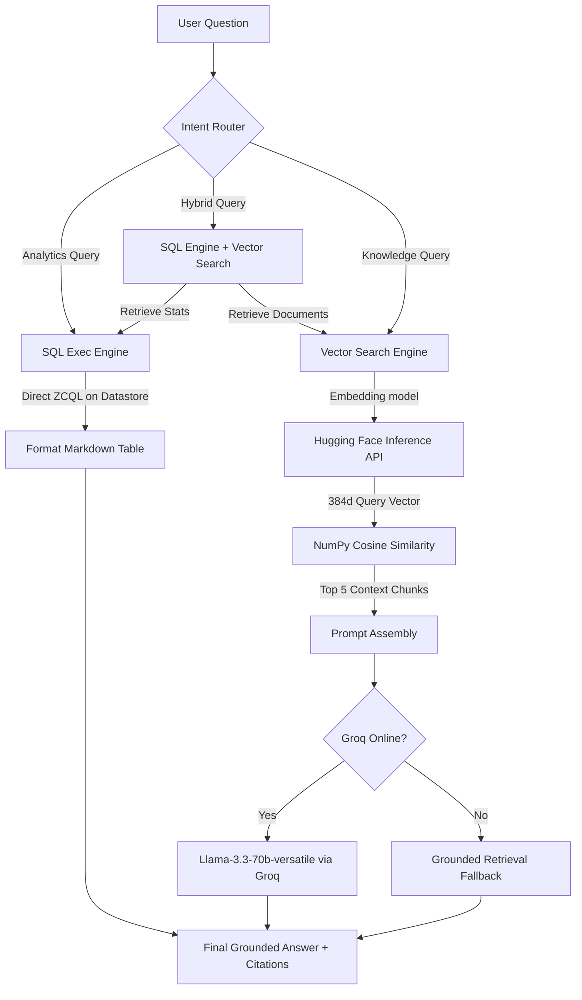

# 09 — RAG System

This document outlines the architecture, intent routing, indexing parameters, and generation pipelines for the **Hybrid RAG (Retrieval-Augmented Generation) Intelligence Assistant** in Project Sentinel.

## Retrieval-Augmented Generation Pipeline

---

## 1. Intent Router & Query Understanding

The query understanding pipeline (located in [router.py](file:///c:/Users/techp/Downloads/more%20projects/Project%20Sentinel/backend/rag/router.py)) classifies user queries into one of three intents:

| Intent | Match Criteria | Actions |
|---|---|---|
| **`analytics`** | Keyword matches for comparisons ("compare Bengaluru and Mysore"), top crime heads ("top crime groups in Shimoga"), timelines ("trends in Kolar"), or performance ranking ("highest arrest rate"). | Executes parameterized ZCQL against Catalyst Data Store; returns formatted markdown tables instantly with **zero LLM overhead**. |
| **`hybrid`** | Explanatory questions ("why", "how", "explain") combined with cyber, finance, or fraud keywords. | Retreives database aggregates AND searches document chunks; feeds both to the LLM to synthesize a statistics-rich analysis. |
| **`knowledge`** | Generic factual questions about policing, regulations, or crime definitions ("what is the definition of organised crime"). | Performs semantic vector search on ingested document chunks and sends matching text blocks to the LLM for grounded answer generation. |

---

## 2. Ingestion & Embedding Parameters

The document corpus (covering PDF, CSV, Excel, GeoJSON, KML, and Shapefiles) is converted into high-performance vector search space using:
- **Parser**: Specialized format parsers (PyMuPDF for PDFs, openpyxl for Excel, pandas for CSV, fiona/geojson/kml parsers for geographic assets).
- **Chunk Size**: `512` characters.
- **Overlap**: `50` characters (to preserve context boundaries).
- **Embedding Model**: `all-MiniLM-L6-v2` (Hugging Face Serverless Inference API, yields `384-dimensional` float arrays).
- **Database Storage**: Embedded vectors stored as JSON strings in the `rag_document_embeddings` table in Zoho Catalyst Data Store and queried in-memory using **NumPy cosine similarity** for fast retrieval.

---

## 3. Answer Generation & Citations

The answer generator (located in [answer_generator.py](file:///c:/Users/techp/Downloads/more%20projects/Project%20Sentinel/backend/rag/answer_generator.py)) enforces **strict factual grounding**:
- **Context injection**: Chunks are parsed and appended to the prompt along with their filename source, page number, row number, layer level, or placemark name depending on the source type.
- **System Instructions**: The LLM is instructed to answer *strictly* using the provided text blocks. If the answer cannot be found in the context, it must reply: `"Based on the retrieved documents, the answer is not available."`
- **Output Structure**: The response includes the generated text, cited source list, and confidence index calculated from retrieval similarity scores.

### Retrieval-Only Fallback (Zero-Fault Architecture)

If the Groq Cloud API or Hugging Face embedding router is unresponsive (e.g. due to rate limits, network latency, or credential errors), the backend automatically degrades to **Retrieval-Only Mode**.
Instead of throwing a 500 error or hallucinating, it returns:
- The exact raw text of the top 3 matching document chunks.
- Clear citations showing document name and page/row/layer index.
- A confidence level indicator.
- A status flag indicating it is running in `fallback_retrieval_only` mode.

This ensures that the judge panel never sees a service crash or a blank assistant box.

## Related Notes
- [[02_System_Architecture]]
- [[04_ETL_Pipeline]]
- [[07_API_Documentation]]
- [[11_Demo_Walkthrough]]
