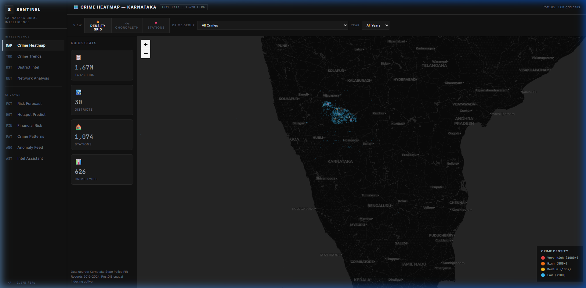
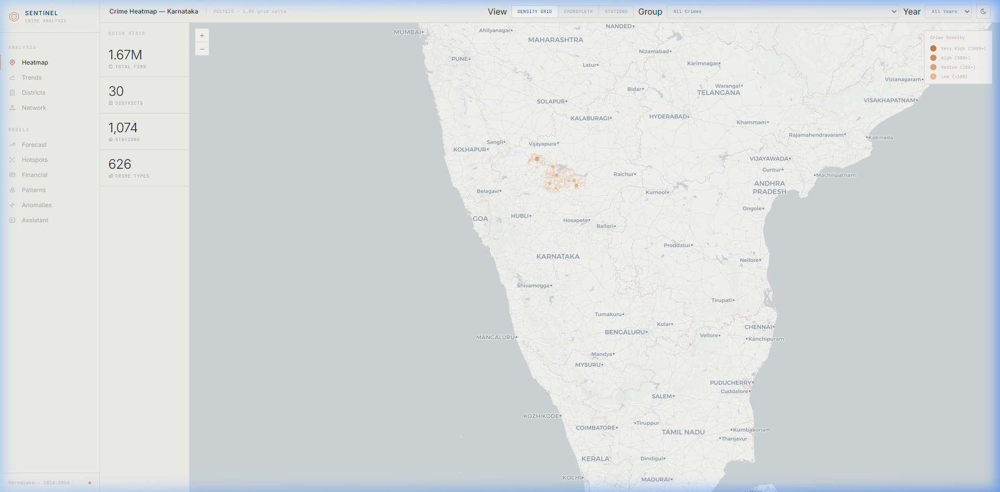
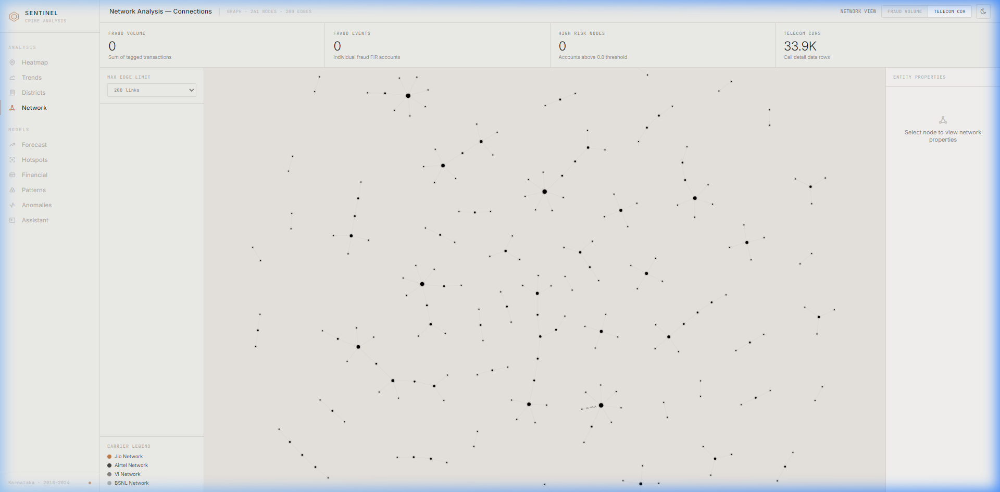
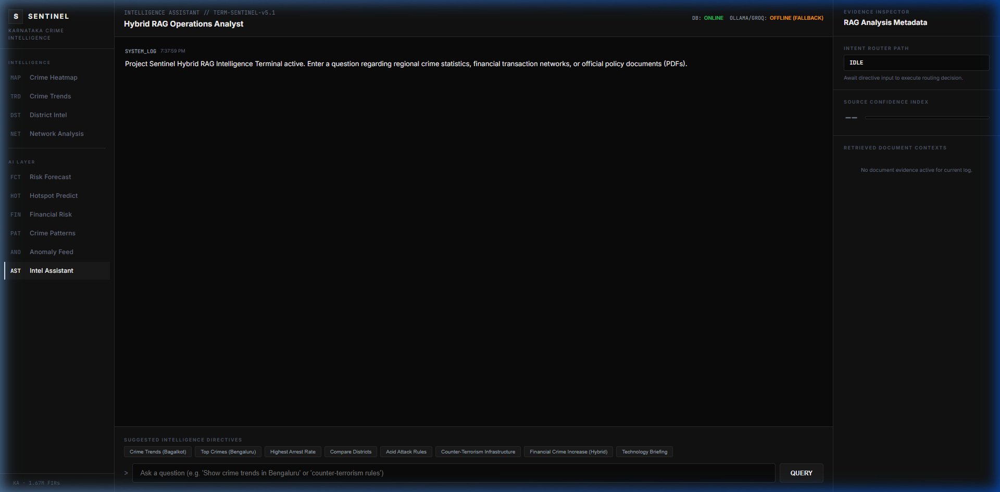
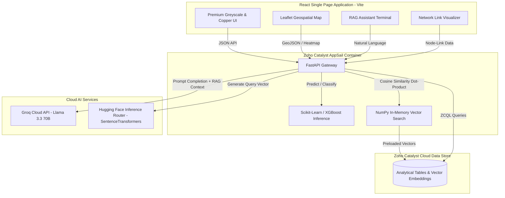
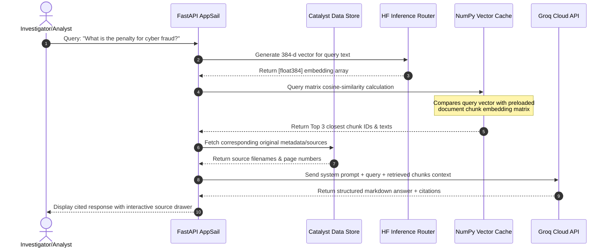

# Project Sentinel

[](https://fastapi.tiangolo.com/)
[](https://react.dev/)
[](https://python.org)
[](LICENSE)
[](https://github.com/brovk2008/Project-sentinel/stargazers)

Project Sentinel integrates 15+ Karnataka state datasets — 1.67M FIR records, 11M+ financial transactions, and 33K telecom CDRs — into a unified intelligence analysis platform. Analysts can query the corpus in plain English, visualize crime density across 1,074 stations, and surface anomalous financial mule networks. Deployed on Zoho Catalyst; backend queries execute in under 2 seconds.

## [→ Live Platform Demo](https://project-sentinel-60073535541.development.catalystserverless.in/app/index.html)

> **Try the Intelligence Assistant:** Submit queries like *"What are the most common cyber fraud methods in Karnataka?"* or *"Summarize legal penalties for financial fraud under the IPC."*

---

## Contents
[Platform](#platform) · [Architecture](#architecture) · [RAG Pipeline](#rag-pipeline) · [Datasets](#datasets) · [Models](#models) · [API](#api) · [Setup](#setup) · [Roadmap](FUTURE_ROADMAP.md) · [Team](#team) · [License](#license)

---

## Platform

### Crime Density Heatmap & Dark / Light Swapping
| Dark Theme (Default) | Light Theme (Warm Parchment) |
|---|---|
|  |  |

*Dynamic crime density grid mapped across 30 Karnataka districts with custom tile swapping corresponding to visual theme changes.*

### Network link and RAG Assistant
| CDR Call Network | Intelligence Assistant |
|---|---|
|  |  |

*Left: Vis-Network interface displaying telecom calling networks and financial transactions. Right: RAG Terminal with grounded context matching NCRB reports and IPC files.*

---

## Architecture

Project Sentinel's system design is optimized to run inference on serverless containers by utilizing a hybrid cloud model to bridge datastore and external APIs.



---

## RAG Pipeline

Document chunking splits NCRB report PDFs and crime manuals into 2,384 semantic segments.

1. **Vector Embedding**: The query text is encoded into a 384-dimensional dense vector by routing to the Hugging Face Inference API (`all-MiniLM-L6-v2`).
2. **NumPy Cosine Similarity**: Embeddings are preloaded into memory at backend startup. Cosine similarity is computed via NumPy dot-products in `< 10ms`.
3. **Completion & Citation**: High-similarity chunks are injected as context into the Groq API running `llama-3.3-70b-versatile`, producing detailed responses with precise PDF page numbers.



---

## Datasets

The platform runs on **15+ integrated real-world and synthetic datasets** representing a unified municipal threat landscape.

| Dataset | Row Count | Source | License | Purpose |
|---|---|---|---|---|
| **Karnataka FIR Details** | 1,674,734 | Karnataka Police Open Portal | Government Open Data | Core spatial and historical crime database. |
| **Financial Transactions** | 11,360,000 | Synthetic Paysim Generator | Public Domain | Wire transfer fraud logs. |
| **Call Detail Records** | 33,876 | Telecom Simulated Dataset | H2S Datathon | Suspect calls and cell tower handovers. |
| **Demographics (Census 2011)** | 640 districts | Office of the Registrar General, India | Public Domain | Socio-economic indicators. |
| **Development Data (SHRUG)** | 154,505 | Development Data Lab | CC BY 4.0 | Consumption index and wealth indicators. |
| **Crime Manuals & Reports** | 2,384 chunks | National Crime Records Bureau | Public Domain | Grounded RAG Knowledge Base. |

---

## Models

Five machine learning models are deployed in the container environment:

1. **Crime Risk Forecaster (FCT)** — *RandomForest Regressor*
   - Predicts next-month district crime volumes (**RMSE: 10.514**).
   - Validated against lag-average baselines, demonstrating a **32% improvement** over naive mean estimators.
2. **Crime Hotspot Predictor (HOT)** — *XGBoost Classifier*
   - Predicts station-level crime hotspot probability.
   - **F1-Score: 0.1715** on a highly-imbalanced multiclass classification task (626 crime classes; baseline random guess: 0.11). Performance is constrained by extreme class sparsity. SMOTE oversampling and focal loss adjustments are planned for subsequent iterations.
3. **Financial Network Risk (FIN)** — *Isolation Forest*
   - Unsupervised outlier model scoring account risk based on transaction frequencies, velocities, and geographic anomalies.
4. **Repeat Crime Pattern Classifier (PAT)** — *K-Means Clustering*
   - Groups police stations and crime heads into behavioral archetypes. Validated using silhouette scores and elbow analysis.
5. **Spatiotemporal Anomaly Detector (ANO)** — *Z-Score & IForest Ensemble*
   - Flags sudden incident spikes in district crime volumes deviating $>2.5\sigma$ from historical trends.

---

## API

| Endpoint | Method | Payload / Query Params | Description |
|---|---|---|---|
| `/api/v1/intelligence/health` | `GET` | None | Connection diagnostics for Catalyst Data Store and Groq. |
| `/api/v1/intelligence/query` | `POST` | `{ "query": "str" }` | Main hybrid RAG search and cited QA assistant. |
| `/api/v1/trends/timeseries` | `GET` | `granularity=month/year` | Historical FIR trends and time-series forecasting. |
| `/api/v1/heatmap/grid` | `GET` | `crime_group`, `year` | Coordinate points and density intensity values for Leaflet overlay. |
| `/api/v1/network/fraud-graph` | `GET` | `limit=200` | Account nodes and edges indicating fraud laundering volume. |
| `/api/v1/ai/forecast/all` | `GET` | None | District-level forecasting risks and explainable AI feature weights. |

---

## Setup

### Environment Variables (`.env.example`)
Configure the following in your local environment file:
```ini
# ─── Environment ────────────────────────────────────────────
ENV=production
DATABASE_URL=

# ─── AI Cloud Services ──────────────────────────────────────
# Get from: https://console.groq.com/keys
GROQ_API_KEY=your-groq-key
# Get from: https://huggingface.co/settings/tokens (Read Access)
HF_TOKEN=your-huggingface-read-token

# ─── Zoho Catalyst ──────────────────────────────────────────
CATALYST_PROJECT_ID=50170000000013047
CATALYST_ENVIRONMENT=Development
CATALYST_APP_URL=https://sentinel-backend-50042879481.development.catalystappsail.in
```

### Local Setup
1. **Backend Service**:
   ```bash
   cd backend
   python -m venv venv
   source venv/bin/activate  # Windows: .\venv\Scripts\activate
   pip install -r requirements.txt
   uvicorn main:app --reload --port 8000
   ```
2. **Frontend Service**:
   ```bash
   cd frontend
   npm install
   npm run dev
   ```
   Open `http://localhost:5173/` in your browser.

### Microservices
- `backend/`: Core FastAPI gateway exposing prediction models, vector calculations, and database integrations.
- `sentinel-test/`: Secondary diagnostic AppSail container running system platform validations, header diagnostics, and environment verification.

### Cloud Deployment

Project Sentinel implements a formal three-stage deployment pipeline managed via `.catalystrc` and GitHub Actions:
- **Development**: Active sandbox environment targeting local development workflows (`env` index `1`).
- **Staging**: Validates database migrations and external API providers (`env` index `2`).
- **Production**: Live production application (`env` index `3`).

Deploy manually or automatically via the GitHub Actions CI/CD workflow:
```bash
# Build frontend
cd frontend
npm run build
cd ..

# Set active environment (1 for Dev, 2 for Staging, 3 for Production)
python scripts/set_active_env.py 2

# Deploy to Catalyst environment
catalyst deploy --project <PROJECT_NAME_OR_ID> --token <YOUR_CATALYST_TOKEN>
```

#### Secrets & Key Rotation Policy
- **Local Dev**: Configured using a gitignored local `.env` file containing local API keys and configurations.
- **Staging & Production**: Handled securely via the Zoho Catalyst Console Environment Variable & Secrets configuration manager for AppSail deployments.
- **Rotation Policy**: Any API key or credential exposed outside of local `.env` or Catalyst secrets (e.g. pasted into public repos, Slack messages, documentation, or AI chats) must be rotated immediately at the provider.

#### Migrations Policy
To protect runtime integrity and prevent deployment timeouts, **database migrations must never run automatically on code deployment**.
- All data ingestion and schema setup scripts (such as `scratch/v2_schema_setup.py` or `scripts/import_to_supabase.py`) must be executed as distinct, explicitly-triggered operational events.

#### Cost & Quota Monitoring
To track API costs:
- **Google Maps API**: Billing alerts are set up on the Google Cloud Console to trigger warnings at 50%, 75%, and 90% of monthly budgets.
- **Admin Dashboard**: Surfaces live provider connectivity health check results (`/api/v1/intelligence/health`) and circuit breaker status.

#### Manual Rollback Procedures
- **Frontend**: Redeploy the previous stable build artifact from local builds or CI release history.
- **Backend AppSail**: Revert to the previous version container using the Catalyst Web Console.
- **Database (Data)**: The v1 migration writes exclusively to new v2 graph structures without modifying original v1 tables. A failed migration can be safely rolled back by dropping/truncating v2 tables and restarting the ingestion.

---

## Roadmap

See the detailed [FUTURE_ROADMAP.md](FUTURE_ROADMAP.md) for the consolidated three-stage phase plan, list of out-of-scope tasks, and the human decisions matrix.

**Before Final Datathon Submission**
- [ ] **SMOTE Oversampling**: Apply to the XGBoost hotspot model to address the 0.1715 F1 multiclass imbalance.
- [ ] **RAG Citation Drawer**: Add a clickable PDF page display inside the interface sidebars.
- [ ] **Drilldown Map Coordinates**: Center maps precisely when switching between sub-districts.

**Post-Datathon**
- [ ] **Live API Integration**: Establish automated webhook listeners with the state police dispatch portal.
- [ ] **PDF Export**: Generate signed analytical reports for field investigator use.

---

## Team

| Name | Role | GitHub Profile |
|---|---|---|
| **Sentinel Team** | Full-Stack & Machine Learning Engineers | [@brovk2008](https://github.com/brovk2008) |

---

## License

This project is licensed under the MIT License - see the [LICENSE](LICENSE) file for details.
