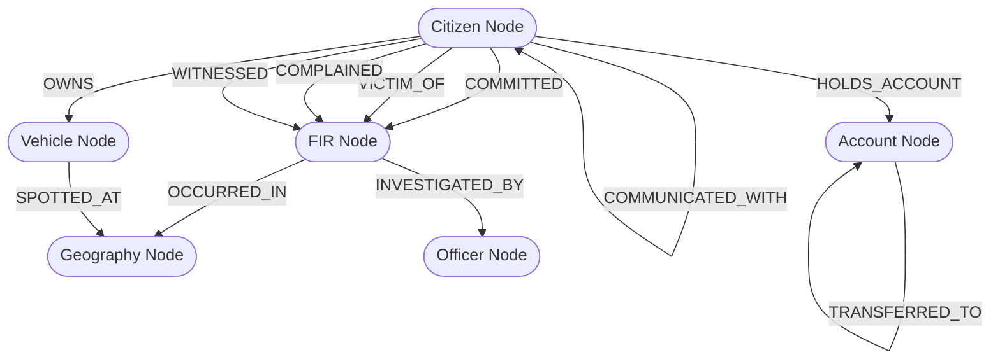
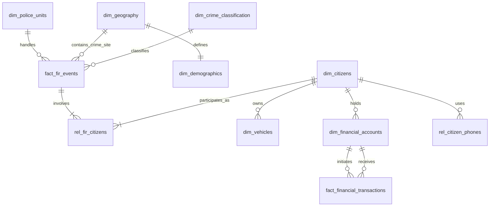

# Project Sentinel: AI-Driven Crime Analytics & Visualization Platform
## Comprehensive Data Architecture & Data Engineering Blueprint

This document defines the complete Data Architecture, Data Engineering, Knowledge Graph, ETL Pipeline, RAG Framework, and Backend System Design for **Project Sentinel**, designed for the Karnataka State Police.

---

## Task 1: Conceptual Dataset Analysis

To support advanced analytics (hotspot detection, predictive forecasting, network analysis, and explainable AI), we categorize all conceptual datasets into a unified schema consisting of **Fact Tables**, **Dimension Tables**, **Relationship (Bridge) Tables**, **Graph Entities (Nodes)**, and **Graph Relationships (Edges)**.

### 1.1 Fact Tables
Fact tables capture quantitative measurements, metrics, and transactional events.
*   `fact_fir_events`: Captures individual First Information Reports (FIRs), occurrences, victim/accused/arrested counts, and location-based coordinates.
*   `fact_financial_transactions`: Stores all financial transaction records (wire transfers, merchant purchases, cash deposits/withdrawals) with fraud labels and risk velocity scores.
*   `fact_call_detail_records (CDR)`: Captures telecommunication links, call durations, cellular towers, and timestamps.

### 1.2 Dimension Tables
Dimension tables store the descriptive attributes and context surrounding the facts.
*   `dim_police_units`: Police stations (Units), unit divisions, circles, districts, and administrative hierarchies.
*   `dim_geography`: Districts, taluks, beats, villages, pin codes, and SHRUG administrative boundaries.
*   `dim_crime_classification`: Categorization of crime groups, crime heads, acts, and sections.
*   `dim_demographics`: Census data, literacy rates, consumption indices, and Facebook wealth indicators mapped to locations.
*   `dim_citizens`: Details of individuals (victims, accused, witnesses, police officers, complainants).
*   `dim_vehicles`: Registered vehicles, owner details, vehicle make/model, registration status.
*   `dim_financial_accounts`: Accounts involved in transactions, owner metadata, bank branches, and risk classifications.
*   `dim_date_time`: Enterprise-wide conformant calendar dimensions (fiscal year, month, day of week, hour, holiday indicators).

### 1.3 Relationship (Bridge) Tables
Used to resolve many-to-many relationships in the relational schema.
*   `rel_fir_citizens`: Maps citizens to FIRs with specific roles (Victim, Accused, Complainant, Witness).
*   `rel_fir_acts_sections`: Maps FIRs to multiple legal provisions (IPC, CrPC, special local laws).
*   `rel_citizen_phones`: Links citizens to active phone numbers (SIM cards).
*   `rel_citizen_vehicles`: Links citizens to registered vehicles (Owner, driver, associate).

### 1.4 Graph Entities (Nodes) and Relationships (Edges)
For graph-based link analysis (e.g., criminal networks, financial money mules, call networks):

```
(Citizen:Accused/Victim) --[COMMUNICATED_WITH]--> (Citizen)
(Citizen)                  --[OWNS]--> (Vehicle)
(Citizen)                  --[HOLDS_ACCOUNT]--> (FinancialAccount)
(FinancialAccount)         --[TRANSFERRED_FUNDS]--> (FinancialAccount)
(Citizen:Accused)          --[COMMITTED]--> (Crime/FIR)
(Crime/FIR)                --[OCCURRED_IN]--> (GeographicArea)
(Crime/FIR)                --[INVESTIGATED_BY]--> (Officer/IO)
```

---

## Task 2: Database Architecture Design

We propose a hybrid database architecture:
1.  **Relational/OLAP Data Warehouse (PostgreSQL with TimescaleDB and PostGIS extensions)**: For spatial-temporal crime records, demographic slicing, and high-performance querying.
2.  **Graph Database (Neo4j)**: For relationship and link analysis (networks, associates, transactional paths).

### 2.1 Relational Schema & Table Definitions

#### 1. `dim_police_units`
*   `unit_id` (INT, PK): Unique identifier for the police unit.
*   `unit_name` (VARCHAR(150), Unique): Name of the police station/office.
*   `district_name` (VARCHAR(100)): District name.
*   `circle_name` (VARCHAR(100)): Police circle/sub-division.
*   `latitude` (DECIMAL(9,6)): Latitude of unit.
*   `longitude` (DECIMAL(9,6)): Longitude of unit.
*   *Indexes*: `idx_unit_district` on (`district_name`), Spatial index `idx_unit_geom` on `geom`.

#### 2. `dim_geography`
*   `geo_id` (VARCHAR(50), PK): Combines SHRUG ID, Village/Area code, or Beat ID.
*   `district_name` (VARCHAR(100)): District name.
*   `sub_district_name` (VARCHAR(100)): Taluk/Sub-District.
*   `beat_name` (VARCHAR(100)): Beat name.
*   `village_area_name` (VARCHAR(150)): Village or urban ward name.
*   `geom` (GEOMETRY(Geometry, 4326)): PostGIS boundary geometry (polygons/multipolygons).
*   *Indexes*: Spatial Index `idx_geo_geom` ON `geom` USING GIST.

#### 3. `dim_demographics`
*   `geo_id` (VARCHAR(50), PK, FK -> `dim_geography.geo_id`): Spatial reference.
*   `population_total` (INT): Census 2011 total population.
*   `population_urban` (INT): Urban population subset.
*   `literacy_rate` (DECIMAL(5,2)): District/sub-district literacy rate.
*   `consumption_index` (DECIMAL(5,2)): SHRUG consumption index.
*   `facebook_wealth_index` (DECIMAL(5,4)): Facebook relative wealth index (RWI).
*   *Indexes*: `idx_demo_rwi` on (`facebook_wealth_index`).

#### 4. `dim_crime_classification`
*   `crime_class_id` (INT, PK): Unique classification ID.
*   `crime_group_name` (VARCHAR(150)): Major crime category (e.g., Cyber Crime, Murder, Theft).
*   `crime_head_name` (VARCHAR(150)): Specific classification header.
*   *Indexes*: `idx_crime_group_head` on (`crime_group_name`, `crime_head_name`).

#### 5. `dim_citizens`
*   `citizen_id` (VARCHAR(50), PK): National ID hash or synthesized master ID.
*   `full_name` (VARCHAR(150)): Name.
*   `gender` (VARCHAR(10)): Male/Female/Other.
*   `age` (INT): Age at registration.
*   `aadhaar_hash` (VARCHAR(64)): Hashed ID.
*   *Indexes*: `idx_citizen_hash` on (`aadhaar_hash`).

#### 6. `dim_vehicles`
*   `registration_number` (VARCHAR(20), PK): Vehicle plate number.
*   `owner_citizen_id` (VARCHAR(50), FK -> `dim_citizens.citizen_id`): Registered owner.
*   `vehicle_make` (VARCHAR(50)): Manufacturer.
*   `vehicle_model` (VARCHAR(100)): Model name.
*   `vehicle_type` (VARCHAR(50)): Two-wheeler, LMV, HGV, etc.
*   `registration_date` (DATE): Date of registration.
*   *Indexes*: `idx_veh_owner` on (`owner_citizen_id`).

#### 7. `dim_financial_accounts`
*   `account_number` (VARCHAR(30), PK): Hashed or unique bank account number.
*   `owner_citizen_id` (VARCHAR(50), FK -> `dim_citizens.citizen_id`): Account holder.
*   `bank_name` (VARCHAR(100)): Bank name.
*   `risk_score` (DECIMAL(3,2)): Mule or fraud risk index (0.0 to 1.0).
*   *Indexes*: `idx_acc_owner` on (`owner_citizen_id`), `idx_acc_risk` on (`risk_score`).

#### 8. `fact_fir_events`
*   `fir_id` (VARCHAR(50), PK): Composite key of District + Unit + Year + FIR No.
*   `fir_number` (VARCHAR(30)): Official FIR reference number.
*   `unit_id` (INT, FK -> `dim_police_units.unit_id`): Handling station.
*   `geo_id` (VARCHAR(50), FK -> `dim_geography.geo_id`): Spatial reference.
*   `crime_class_id` (INT, FK -> `dim_crime_classification.crime_class_id`): Crime classification.
*   `fir_date` (TIMESTAMP): Date of registering FIR.
*   `offence_start_time` (TIMESTAMP): Start of crime occurrence.
*   `offence_end_time` (TIMESTAMP): End of crime occurrence.
*   `fir_type` (VARCHAR(50)): Heinous, Non-heinous, etc.
*   `fir_stage` (VARCHAR(100)): Under Investigation, Charge-sheeted, Convicted, Closed.
*   `complaint_mode` (VARCHAR(100)): Written, Oral, Online.
*   `io_name` (VARCHAR(150)): Investigating Officer name.
*   `io_kgid` (VARCHAR(20)): Officer service identification code.
*   `victim_count` (INT): Total victims.
*   `accused_count` (INT): Total accused.
*   `arrested_count` (INT): Total arrested.
*   `conviction_count` (INT): Convicted count.
*   `latitude` (DECIMAL(9,6)): Precise coordinates.
*   `longitude` (DECIMAL(9,6)): Precise coordinates.
*   `geom` (GEOMETRY(Point, 4326)): GIS Point mapping.
*   *Indexes*: Spatial index `idx_fir_geom` ON `geom` USING GIST, Compound index `idx_fir_temporal` on (`fir_date`), Partitioned on `fir_date` (yearly).

#### 9. `fact_financial_transactions`
*   `transaction_id` (VARCHAR(50), PK): Unique transaction reference.
*   `timestamp` (TIMESTAMP): Transaction date and time.
*   `sender_account` (VARCHAR(30), FK -> `dim_financial_accounts.account_number`): Originating account.
*   `receiver_account` (VARCHAR(30), FK -> `dim_financial_accounts.account_number`): Destination account.
*   `amount` (DECIMAL(15,2)): Transaction amount.
*   `transaction_type` (VARCHAR(30)): CASH_OUT, TRANSFER, PAYMENT, etc.
*   `merchant_category` (VARCHAR(50)): Retail, Gambling, Shell Company, etc.
*   `velocity_score` (DECIMAL(5,2)): Velocity risk score.
*   `geo_anomaly_score` (DECIMAL(5,2)): Location anomaly score.
*   `is_fraud` (BOOLEAN): Label indicating confirmed/suspected fraud.
*   *Indexes*: `idx_tx_sender` on (`sender_account`), `idx_tx_receiver` on (`receiver_account`), `idx_tx_fraud` on (`is_fraud`), partitioned by month on `timestamp`.

#### 10. `fact_call_detail_records`
*   `cdr_id` (VARCHAR(50), PK): Call log unique identifier.
*   `caller_number` (VARCHAR(20)): Initiator number.
*   `receiver_number` (VARCHAR(20)): Receiver number.
*   `call_timestamp` (TIMESTAMP): Time of call.
*   `duration_seconds` (INT): Call duration.
*   `cell_tower_id` (VARCHAR(50)): Cell tower geographic code at call start.
*   *Indexes*: `idx_cdr_caller` on (`caller_number`), `idx_cdr_receiver` on (`receiver_number`), partitioned by week on `call_timestamp`.

#### 11. `rel_fir_citizens`
*   `fir_id` (VARCHAR(50), FK -> `fact_fir_events.fir_id`)
*   `citizen_id` (VARCHAR(50), FK -> `dim_citizens.citizen_id`)
*   `role` (VARCHAR(50)): 'Accused', 'Victim', 'Complainant', 'Witness'.
*   `is_arrested` (BOOLEAN)
*   `is_chargesheeted` (BOOLEAN)
*   *Primary Key*: (`fir_id`, `citizen_id`, `role`)
*   *Indexes*: `idx_rel_citizen` on (`citizen_id`).

---

## Task 3: Crime Knowledge Graph Design

For criminal network analysis, money laundering, and suspect communication, a property graph database is designed using Cypher syntax structures.



### 3.1 Graph Nodes (Entities)
1.  **`Citizen`**
    *   *Properties*: `citizen_id` (Key), `name`, `gender`, `age`, `risk_score`
2.  **`FIR`**
    *   *Properties*: `fir_id` (Key), `fir_number`, `crime_group`, `crime_head`, `act_sections`, `registered_date`, `stage`
3.  **`Account`**
    *   *Properties*: `account_number` (Key), `bank_name`, `owner_name`, `risk_score`
4.  **`Vehicle`**
    *   *Properties*: `registration_number` (Key), `make`, `model`, `type`
5.  **`Officer`**
    *   *Properties*: `kgid` (Key), `name`, `rank`, `police_station`
6.  **`Geography`**
    *   *Properties*: `geo_id` (Key), `district`, `taluk`, `beat`, `village_name`

### 3.2 Graph Edges (Relationships)
1.  **`COMMITTED`**: `(Citizen) -[:COMMITTED {is_arrested: Boolean, is_chargesheeted: Boolean}]-> (FIR)`
2.  **`VICTIM_OF`**: `(Citizen) -[:VICTIM_OF]-> (FIR)`
3.  **`COMMUNICATED_WITH`**: `(Citizen) -[:COMMUNICATED_WITH {duration_sec: Int, timestamps: List<DateTime>}]-> (Citizen)`
4.  **`TRANSFERRED_TO`**: `(Account) -[:TRANSFERRED_TO {amount: Float, timestamp: DateTime, transaction_id: String}]-> (Account)`
5.  **`OWNS`**: `(Citizen) -[:OWNS]-> (Vehicle)`
6.  **`INVESTIGATED`**: `(Officer) -[:INVESTIGATED {role: String}]-> (FIR)`
7.  **`LOCATED_IN`**: `(FIR) -[:LOCATED_IN]-> (Geography)`
8.  **`ASSOCIATE_OF`**: `(Citizen) -[:ASSOCIATE_OF {strength: Float, type: String}]-> (Citizen)` (derived link based on joint crimes or shared assets)

---

## Task 4: ETL Pipeline Design

The ETL pipeline uses Apache Spark / PySpark for batch jobs and Kafka/Spark Streaming for transactional streams.

```
[Raw Sources: CSVs, PDFs, Streams] 
      --> [Spark Extraction / PDF OCR Engine]
      --> [Silver Layer: Cleansed, Geo-resolved, Deduplicated Data]
      --> [Gold Layer: TimescaleDB PostGIS + Neo4j Graph DB]
```

### 4.1 FIR Details Dataset ETL
*   **Raw Source**: `FIR_Details_Data.csv` (572MB, comma-separated, inconsistent date formats, missing coordinates).
*   **Cleaning Steps**:
    1.  Parse `FIR_YEAR`, `FIR_MONTH`, and `FIR_Day` into a unified `ISO-8601` `timestamp` string.
    2.  Filter out records with coordinates outside Karnataka boundaries (Bounding box: Lat 11.5°N to 18.5°N, Long 74.0°E to 78.5°E).
    3.  Deduplicate based on composite key (`District_Name`, `UnitName`, `FIR_YEAR`, `FIR_number`).
    4.  Impute missing coordinates using `Village_Area_Name` or `Beat_Name` centroid lookups from GIS geodata.
*   **Transformations**:
    1.  Perform String similarity mapping (e.g., Levenshtein Distance) to resolve misspelt district/unit names.
    2.  Normalize `ActSection` into array elements: split strings like `"IPC 1860:302, 34"` into structured mappings.
    3.  Compute aggregate flags: `has_victims`, `has_minor_victims` (derived from `Boy` and `Girl` counts).
*   **Final Destination**: `fact_fir_events` (OLAP table), `dim_police_units`, and `rel_fir_citizens`.

### 4.2 Financial Fraud Datasets (PaySim & Fraud Transaction Dataset)
*   **Raw Source**: `financial_fraud_detection_dataset.csv` (796MB) & `PS_20174392719_1491204439457_log.csv` (493MB).
*   **Cleaning Steps**:
    1.  Map relative `step` column in PaySim to actual temporal values starting from an arbitrary reference timestamp (e.g., `2024-01-01 00:00:00` + `step` * 1 Hour).
    2.  Deduplicate transactions using `transaction_id`.
    3.  Convert negative values in balance columns (`oldbalanceOrg`, `newbalanceOrig`) to zero or flag as anomaly.
*   **Transformations**:
    1.  Join sender and receiver account metrics.
    2.  Calculate account-level cumulative rolling transaction volume (1-hour, 24-hour windows) to refresh `velocity_score`.
    3.  Extract geographic anomalies (comparing transaction location with historical IP/GPS bounds).
*   **Final Destination**: `fact_financial_transactions` & `dim_financial_accounts`.

### 4.3 Demographic & Geographical Datasets (SHRUG, Census, Geodata)
*   **Raw Source**: Excel files (`2011-India*.xlsx`), Census CSVs, Facebook RWI CSVs, KML boundary maps.
*   **Cleaning Steps**:
    1.  Extract KML layers using `Fiona`/`GeoPandas` and convert to PostGIS WKT (Well-Known Text).
    2.  Clean Census strings to ensure matching with FIR administrative names (e.g., standardizing `BENGALURU` vs `BANGALORE`).
*   **Transformations**:
    1.  Map Shrug ID (`shrid`) to Census 2011 Village/Town codes.
    2.  Generate a spatial index grid (H3 Hexagonal Hierarchical Spatial Index, resolution 8) to join demographics with FIR coordinate points without expensive polygon calculations.
*   **Final Destination**: `dim_demographics` and `dim_geography`.

### 4.4 Call Detail Records (CDR) Dataset
*   **Raw Source**: `CDR-Generator` generated CSV logs.
*   **Cleaning Steps**:
    1.  Validate phone formats to Indian standards (+91 or 10-digit).
    2.  Null-fill missing durations with median duration values.
*   **Transformations**:
    1.  Resolve `Caller` and `Receiver` numbers to identity profiles in `dim_citizens` via KYC registry.
    2.  Aggregate edge weights (total count of calls, total duration) for ingestion into the Graph DB.
*   **Final Destination**: `fact_call_detail_records` and Graph Database edges `[:COMMUNICATED_WITH]`.

---

## Task 5: Missing Data & Synthesis Strategy

To build a fully functional system, we identify missing, synthetic, and derived variables:

| Category | Field Name | Source / Methodology |
| :--- | :--- | :--- |
| **Missing Data (Unavailable)** | Citizen Identifiers (Aadhaar / National ID) | Must be synthesized/pseudonymized for Hackathon compliance using hashed KYC details. |
| **Missing Data (Unavailable)** | Cellular Tower GIS Locations | Synthesized based on matching `cell_tower_id` with centroids of `dim_geography` beats. |
| **Derived Fields** | `offence_duration_minutes` | Calculated: `offence_end_time` - `offence_start_time`. |
| **Derived Fields** | `velocity_24h_amount` | Cumulative amount spent by sender account in last 24h. |
| **Derived Fields** | `is_geo_anomaly` | Boolean flag. True if `distance(transaction_loc, usual_loc) > 100km` and speed of travel physically impossible. |
| **Synthesized Fields** | `accused_association_score` | Graph centrality score representing closeness between suspects based on shared phone calls and co-accused FIRs. |
| **Synthesized Fields** | `hotspot_severity_index` | Density value computed via KDE (Kernel Density Estimation) using temporal decay factor. |

---

## Task 6: Master Data Dictionary

### Table: `fact_fir_events`
*   `fir_id` (VARCHAR(50)): Unique composite primary key. Source: `FIR_Details_Data.csv`
*   `unit_id` (INT): Police station unique key. Source: Derived from `UnitName`
*   `geo_id` (VARCHAR(50)): Administrative geographic key. Source: Derived from `Village_Area_Name`
*   `fir_date` (TIMESTAMP): FIR registration date. Source: `FIR_Details_Data.csv` (Parsed)
*   `victim_count` (INT): Total victims. Source: `VICTIM COUNT`
*   `accused_count` (INT): Total accused. Source: `Accused Count`
*   `geom` (GEOMETRY(Point, 4326)): Spatial coordinate point. Source: `Latitude` / `Longitude`

### Table: `dim_demographics`
*   `geo_id` (VARCHAR(50)): Geographic area key. Source: Census 2011 / SHRUG
*   `population_total` (INT): Total population in region. Source: Census 2011
*   `literacy_rate` (DECIMAL(5,2)): Literacy percentage. Source: District Literacy Dataset
*   `facebook_wealth_index` (DECIMAL(5,4)): Relative wealth index. Source: Facebook RWI Dataset

### Table: `fact_financial_transactions`
*   `transaction_id` (VARCHAR(50)): Unique transaction ID. Source: Fraud Transaction Dataset
*   `sender_account` (VARCHAR(30)): Outgoing account ID. Source: PaySim / Fraud Transaction Dataset
*   `receiver_account` (VARCHAR(30)): Incoming account ID. Source: PaySim / Fraud Transaction Dataset
*   `amount` (DECIMAL(15,2)): Currency transfer volume. Source: PaySim
*   `is_fraud` (BOOLEAN): Fraud flag. Source: PaySim (`isFraud`) / Dataset (`is_fraud`)

---

## Task 7: Entity Relationship Diagram (ERD)



---

## Task 8: Retrieval-Augmented Generation (RAG) Architecture

To query national Crime In India PDFs and specialized guidelines (Organized Crime, Acid Attack, Terrorism), we deploy a production-grade RAG pipeline.

```
[PDFs] 
  --> [Unstructured.io Parser / OCR]
  --> [Layout-Aware Chunking (512 tokens + 10% overlap)]
  --> [NV-Embed-QA / BGE-M3 Embeddings]
  --> [Vector Index (pgvector / Qdrant) + BM25 Lexical Index]
  --> [Hybrid Retrieval (Reciprocal Rank Fusion)]
  --> [Cross-Encoder Reranker (Cohere/BGE)]
  --> [LLM Context Window (Llama-3-70B)]
```

### 8.1 Chunking Strategy
*   **Methodology**: *Layout-Aware Semantic Chunking*. Standard character/token splitting breaks down tables, statutory act structures, and law references.
*   **Implementation**: Use `Unstructured.io` or `LlamaParse` to preserve document visual structure (headers, tables, sections).
*   **Chunk Size**: 512 tokens (~350 words) with 64 tokens (12.5% overlap) to maintain contextual transitions.
*   **Formatting**: Convert tables directly to Markdown tables inside chunks to preserve matrix relationships.

### 8.2 Embedding Strategy
*   **Model**: `bge-m3` or `text-embedding-3-large` (1536-3072 dimensions).
*   **Dense Vectors**: Standard representation of semantic meaning.
*   **Sparse Vectors**: Extract BM25 token frequencies to capture exact statutory keywords (e.g., "IPC Section 302", "MCOCA", "KCOCA").

### 8.3 Metadata Schema
To support highly targeted retrieval, every vector chunk is enriched with structured metadata:
```json
{
  "document_name": "Crime in India 2024 Volume I.pdf",
  "chapter": "Chapter 3: Crimes against Women",
  "legal_acts": ["IPC", "POCSO"],
  "ipc_sections": ["354", "376"],
  "page_number": 142,
  "state_reference": "Karnataka",
  "chunk_type": "text | table | definition"
}
```

### 8.4 Retrieval & Fusion Strategy
1.  **Hybrid Search**: Execute concurrent vector search (cosine similarity) and lexical search (BM25) on the metadata filtered scope.
2.  **RRF (Reciprocal Rank Fusion)**: Combine dense and sparse lists using:
    $$RRF\_Score(d) = \sum_{m \in M} \frac{1}{k + r_m(d)}$$
    *(where $k = 60$, and $r_m(d)$ is the rank of document $d$ in system $m$)*.
3.  **Reranking**: Feed Top 30 candidate chunks to a Cross-Encoder model (`bge-reranker-large`) to select the top 5 most relevant contexts.

---

## Task 9: Backend Architecture & AI Orchestration

We design a decoupled, containerized microservices backend. No UI components are hosted in this architecture.

```
   [API Gateway (FastAPI / Kong)]
                 |
      +----------+----------+
      |                     |
[Analytics Service]   [AI & NLP Service]
      |                     |
      |                     +--> [RAG Engine / Vector DB]
      |                     +--> [Forecasting Models]
      |
[Data Layer (PostGIS / Neo4j / Redis)]
```

### 9.1 Data Layer
*   **Relational Storage**: PostgreSQL 16 + TimescaleDB (for temporal partitioning of call logs/transactions) + PostGIS (for spatial coordinates and polygons).
*   **Graph Engine**: Neo4j Enterprise (for real-time Cypher execution on co-accused links and money mule chains).
*   **Cache Store**: Redis Cluster (for holding session caches, active investigator tasks, and hot coordinates).

### 9.2 Analytics Layer
*   **Hotspot Analysis Engine**: Spatial statistical services calculating Kernel Density Estimation (KDE) and Getis-Ord $Gi^*$ hotspot statistics.
*   **Link Analytics Engine**: Network algorithm execution (PageRank to find key leaders in syndicates, Louvain Community Detection to segment gangs).
*   **Spatio-Temporal Aggregator**: Runs background cron jobs (using Celery/RabbitMQ) to build aggregate tables grouped by H3 indexes and temporal buckets.

### 9.3 Graph Layer
*   **Query Executor**: Translates relational joins into Cypher queries.
*   **Graph Algorithms (Neo4j GDS)**: Executes Weekly Node2Vec, Weakly Connected Components (WCC), and Cosine Similarity computations to auto-surface linked crime groups.

### 9.4 AI & Forecasting Layer
*   **Predictive Model (Spatio-Temporal Graph Neural Networks - ST-GNN)**: Forecasts crime occurrence probabilities in H3 cells based on historical FIR density, demographic indicators (wealth, literacy), and weather/holiday factors.
*   **Explainable AI Engine (SHAP/LIME)**: Generates feature-attribution weights for every predictive crime forecast (e.g., *"High risk score due to: 42% increase in night-time transactions, 2 previous auto-thefts within 300m"*).
*   **NLP Extraction Service**: Named Entity Recognition (NER) pipeline (using custom-trained spaCy models) to extract suspect names, vehicles, addresses, and weapons from the unstructured text of the "Place of Offence" or FIR descriptions.

### 9.5 API Layer (FastAPI Specification)
*   **`/api/v1/analytics/hotspots`**: Returns geo-JSON polygons of high-density crime hot-zones filtered by crime-group and temporal windows.
*   **`/api/v1/network/suspect/{citizen_id}`**: Retrieves direct associates, calling frequencies, shared transactions, and risk centrality metrics.
*   **`/api/v1/prediction/forecast`**: Predicts crime index for a target police beat or H3 cell for the upcoming 7-day period.
*   **`/api/v1/rag/query`**: Processes investigator query using hybrid retrieval and generates formal legal summaries from the PDFs.

---

### Verification Plan
*   **Automated Verification**: Build unit test assertions in Python verifying spatial containment (ensuring lat/long resolve cleanly within Karnataka boundaries). Validate schema constraints on Postgres and Cypher node property enforcement on Neo4j.
*   **Simulated Integration**: Test the pipeline using subsets of the `financial_fraud` and `FIR_Details` CSVs, verifying that end-to-end transformation time matches acceptable latency (<50ms query response on Redis, <3s batch pipeline updates on the Spark layer).
