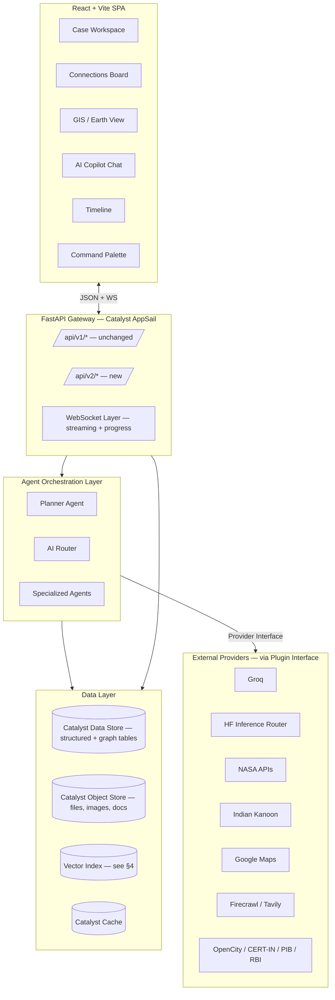
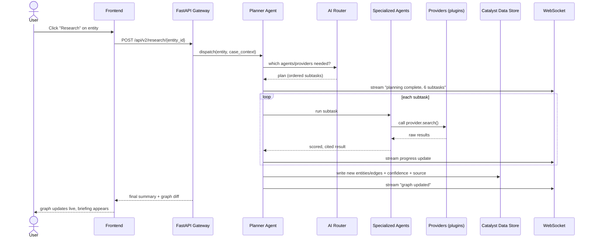

# 01 — System Architecture

**Depends on:** `00_Vision.md`

---

## 1. High-Level Architecture

## 2. Service Boundaries

Sentinel v2 is **not** a microservices rewrite in the literal sense (separate deployable services per module) — that would conflict with non-negotiable #5 (v1 stays live) and with Catalyst AppSail's deployment model. Instead, it is **modular monolith with a plugin boundary**:

- One FastAPI app, organized into routers/modules that mirror the 12-doc structure
- Internal module boundaries are enforced by Python package structure and the Provider Interface (see `07_API_Integrations.md` §2), not by network calls
- This can be split into real separate AppSail containers later (Phase 2+) if a specific module (e.g. the Agent Orchestration Layer) needs independent scaling — call this out as a Phase 2 decision, not a Phase 0 requirement

**Why this deviates from "microservices" as originally pitched:** the original brainstorm called for literal separate services per data source. In practice, on Catalyst AppSail, that means N deployable containers with N cold-starts on a free/low tier — which actively hurts the "premium, responsive, no blank screens" UX goal in `00_Vision.md` §5. The plugin-interface pattern gets the same maintainability win (swap a provider without touching core code) without the deployment cost. This is a deliberate architecture decision, flagged here rather than silently substituted.

## 3. Request Flow — Example: "Research" button pressed on an entity

## 4. Key Technical Decision: Vector Search Migration

**v1 state:** embeddings for 2,384 document chunks are precomputed and held in a NumPy matrix in process memory at backend startup; cosine similarity is a dot-product over that matrix. This works at v1's scale and gives the documented `<10ms` retrieval.

**Why it won't survive v2 as-is:** Permanent Memory (`05_RAG_System.md`) means the corpus grows continuously and arbitrarily — every uploaded case file, every research-button result, every scraped document. An in-memory matrix that's rebuilt at startup:
- Doesn't scale past low tens of thousands of chunks on typical AppSail container memory limits
- Loses new uploads until the next process restart unless explicitly re-synced
- Can't be sharded per-Case, which the Case-scoped memory model in `09_Investigation_Workspace.md` requires

**Decision:** Phase 0–1 introduces a real vector index, evaluated against two options — both documented because the choice affects `08_Catalyst_Architecture.md` and should be made with awareness of Catalyst's actual managed offerings at implementation time, not assumed:

| Option | Pros | Cons |
|---|---|---|
| Catalyst Data Store + application-level approximate search (e.g. a maintained sorted/bucketed embedding table, refreshed incrementally) | Stays inside Catalyst, no new infra | More engineering to get right; not a true ANN index |
| Dedicated vector DB (e.g. a managed pgvector/Pinecone-class service) reached via the Provider Interface | True ANN performance at scale | New external dependency, new cost line, another secret to manage |

**Recommendation for Phase 0:** keep NumPy in-memory as a **per-Case cache** (small N per case, rebuilt on Case load — not global), backed by a persistent embedding table in Catalyst Data Store as source of truth. This preserves v1's speed characteristic at the scale it actually matters (one Case's working set) while solving the "nothing is lost" requirement. Re-evaluate a dedicated vector DB only if a single Case's corpus exceeds ~20K chunks in practice. This avoids adding a new external dependency before it's proven necessary.

## 5. Key Technical Decision: Knowledge Graph on Catalyst Data Store

**Problem:** Catalyst Data Store is a tabular/NoSQL store (ZCQL-queryable tables), not a native graph database. The Connections Board and Knowledge Graph (`04_Knowledge_Graph.md`) need node/edge traversal semantics.

**Decision:** model the graph as two tables plus materialized views, rather than introducing a separate graph database:

- `entities` table: `id, case_id, type, properties (JSON), confidence, created_by, created_at, updated_at`
- `relationships` table: `id, case_id, source_entity_id, target_entity_id, relationship_type, label, confidence, evidence (JSON array), created_by, created_at`
- A materialized adjacency cache (refreshed on write, stored in Catalyst Cache) serves graph-traversal reads (e.g. "all nodes within 2 hops of X") without re-querying the full table on every Connections Board render

**Why not Neo4j or another dedicated graph DB:** `00_Vision.md` non-negotiable #4 (plugin-first, don't reinvent what Catalyst provides) and the original instruction to leverage Catalyst's managed capabilities rather than bolt on new infrastructure. A dedicated graph DB is the "correct" answer at very large scale (hundreds of thousands of entities with deep multi-hop queries), but Sentinel's actual graph sizes are per-Case and investigator-curated, not web-scale — the adjacency-cache approach is documented as the Phase 0–1 answer, with a note in `11_Future_Roadmap.md` to revisit if a Case's graph exceeds ~50K nodes.

## 6. Environments

| Environment | Purpose | Catalyst Project Stage |
|---|---|---|
| `development` | Active development, matches v1's current `CATALYST_ENVIRONMENT=Development` | Development |
| `staging` | Pre-release validation, new in v2 | Staging (new Catalyst stage to provision) |
| `production` | Live platform | Production |

## 7. Cross-Cutting Concerns (apply to every module)

- **Streaming-first:** any AI action >1s must stream partial output over WebSocket, not block on a single HTTP response. (`00_Vision.md` §5 — "no blank screens")
- **Idempotent writes:** every agent action that writes to the graph must be safe to retry (use idempotency keys), since network calls to free-tier external APIs will fail and retry.
- **Case-scoped everything:** no module-level global state. All queries, caches, and embeddings are filtered by `case_id` first.
