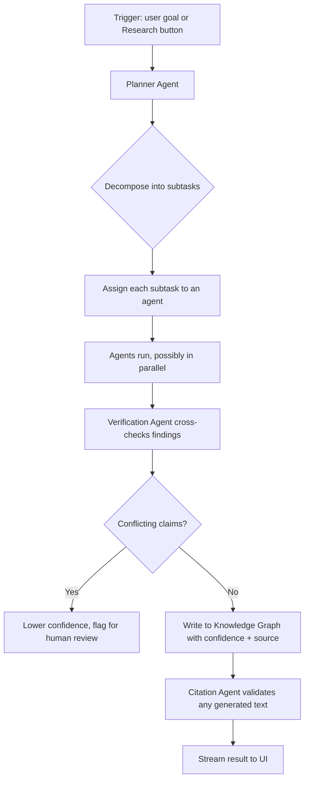

# 03 — Agent System & AI Router

**Depends on:** `00_Vision.md`, `01_System_Architecture.md`, `07_API_Integrations.md` (for provider-specific rate limits)

---

## 1. Why Multi-Agent Instead of One Chatbot

v1's `/api/v1/intelligence/query` endpoint is a single-shot RAG call: embed query → cosine similarity → inject context → Groq completion. This is correct for "answer a question grounded in documents" and **stays exactly as-is** as the v1 endpoint.

v2 adds a second, parallel capability for tasks that require *multiple steps across multiple sources* (e.g. the Research button) — this is where a single-shot RAG call breaks down, because no single retrieval pass can decide "I should also check the legal database and the satellite imagery." That decision-making is what the Planner Agent exists for.

## 2. Agent Roster

| Agent | Responsibility | Primary tools/providers |
|---|---|---|
| **Planner Agent** | Decomposes a user goal or Research-button trigger into ordered subtasks; decides which agents to invoke | AI Router (reasoning-tier model) |
| **RAG Agent** | Searches Permanent Memory (Case documents) | Vector index (`05_RAG_System.md`) |
| **OSINT Agent** | Web/news/government source search | Firecrawl, Tavily |
| **Geospatial Agent** | Location resolution, satellite imagery, street view | NASA APIs, Mapillary, Google Maps |
| **Legal Agent** | Case law, statute lookup, legal summarization | Indian Kanoon |
| **Financial Intelligence Agent** | Transaction pattern analysis | Wraps v1's Isolation Forest model |
| **Forecast Agent** | Risk/hotspot prediction | Wraps v1's RandomForest + XGBoost models |
| **Verification Agent** | Cross-checks claims across sources before they're written to the graph; assigns confidence | AI Router (verification-tier) + rule-based checks |
| **Timeline Agent** | Orders events chronologically, detects gaps/conflicts | Internal, queries `relationships`/`entities` tables |
| **Memory Agent** | Reads/writes Case Memory (see §5) | Catalyst Data Store |
| **Report Agent** | Compiles briefings, exports | AI Router (long-form tier) |
| **Citation Agent** | Ensures every claim in generated text has a traceable source | Internal, validates Report Agent output before it's shown to the user |

Every agent communicates through a structured message format (not free text):

```json
{
  "agent": "OSINTAgent",
  "task_id": "uuid",
  "case_id": "uuid",
  "status": "complete | partial | failed",
  "findings": [
    {
      "claim": "string",
      "source": "url or provider name",
      "confidence": 0.0,
      "evidence_type": "direct_quote | inference | metadata_match"
    }
  ],
  "errors": []
}
```

This structured format is what lets the Verification Agent and Citation Agent operate generically across any upstream agent's output, and is what feeds the Explainability UI (`02_UI_UX.md` §4) directly — `findings[].confidence` and `.source` map 1:1 to what's rendered on hover.

## 3. Planner Flow



The Planner does **not** free-form decide tools every single time from scratch — it selects from a registered capability list (each agent declares what it can do via a `capabilities()` method, mirroring the Provider Interface in `07_API_Integrations.md` §2). This keeps planning bounded and debuggable rather than an unconstrained agent loop.

## 4. AI Router

**Purpose:** select the cheapest capable model/provider per task, with real fallback — not an aspirational routing table.

| Task type | Primary | Fallback | Notes |
|---|---|---|---|
| Fast classification / short reasoning | Groq (Llama 3.3 70B) | — | Matches v1's existing usage |
| Embeddings | HF Inference Router (`all-MiniLM-L6-v2`) | — | Matches v1 exactly |
| Long-form report generation | Groq (larger context call) | Secondary provider TBD at implementation (see note below) | |
| Vision / OCR | TBD — no vision provider exists in v1 | Must be added in `07_API_Integrations.md` before this row is implementable | |
| Verification (cross-checking) | Same model as primary, different prompt/temperature | A second distinct provider, if budget allows | Using a *different* model for verification reduces correlated errors |

**Note on providers not yet in v1:** the original brainstorm names Gemini and Mistral for several roles. v1's actual stack only has Groq and HF. This doc deliberately does **not** assume Gemini/Mistral access exists — adding them is a `07_API_Integrations.md` decision (new secret, new quota to manage) and should happen explicitly, not be assumed by the Agent System doc. Until then, Groq is the default for every reasoning task, and the router table above reflects that reality rather than the aspirational version.

### 4.1 Free-Tier Fallback Logic (required, not optional)

Every provider call through the Router must implement:

1. **Rate-limit detection** — catch 429s explicitly, don't treat as a generic failure
2. **Exponential backoff with jitter** — bounded retry count (e.g. 3 attempts)
3. **Circuit breaker per provider** — after N consecutive failures, mark provider "unhealthy" for a cooldown window and skip it in routing (surfaced in the Admin screen, `02_UI_UX.md` §3)
4. **Graceful degradation** — if the primary model for a task is unavailable, the Router falls back to *any* healthy provider capable of that task type, even if not optimal, and flags the response as "generated with fallback model X" in the agent message (`findings[].source` field)
5. **Caching** — identical queries within a short TTL window (Catalyst Cache) are served from cache before hitting a rate-limited free-tier API again

This logic lives in the Router, not duplicated per-agent — every agent calls `router.complete(task_type, prompt)` and never calls a provider SDK directly.

## 5. Case Memory (not "AI memory")

Per the original brainstorm's correct instinct: **don't give the AI generic memory, give it Case Memory.**

```
Case
 └── memory/
      ├── context.json       (current goals, open questions)
      ├── reasoning_log.jsonl (append-only agent reasoning trace)
      ├── notes.json          (user + AI notes, distinguished by author)
      ├── hypotheses.json     (see 09_Investigation_Workspace.md §5)
      └── chat_history.jsonl
```

Every agent invocation reloads relevant Case Memory before acting — this is what the original brainstorm meant by "no hallucinations": the model isn't relying on its own conversational memory (which doesn't persist across serverless invocations anyway), it's reloading structured, persisted state every time. This also directly satisfies non-negotiable #1 (refresh-safe).

## 6. Mermaid/Diagram Generation

The Report Agent (or a dedicated lightweight "Diagram Agent," implementation detail left to Phase 1) generates Mermaid syntax for:
- Flowcharts
- Sequence diagrams
- Timelines
- Mind maps
- Decision trees

Generated Mermaid is validated (parsed) server-side before being sent to the frontend, to avoid rendering broken diagrams — this is a small but real failure mode worth guarding against explicitly.

## 7. Phased Rollout

- **Phase 0:** Planner + RAG Agent + Router with Groq/HF only (matches what's actually available today)
- **Phase 1:** OSINT, Geospatial, Legal, Verification, Timeline, Memory, Citation agents
- **Phase 2:** Financial Intelligence + Forecast agents wired to existing ML models; multi-provider verification
