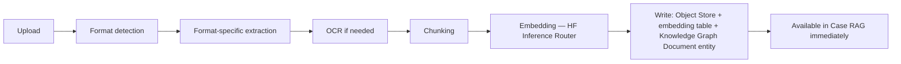

# 05 — RAG System & Permanent Memory

**Depends on:** `00_Vision.md`, `01_System_Architecture.md` §4 (vector index decision), `06_Data_Ingestion.md`

---

## 1. v1 Baseline (exact, carried forward)

v1's RAG pipeline, as documented and shipped:

1. Document chunking: NCRB report PDFs and crime manuals → 2,384 semantic segments
2. Embedding: query text → 384-dim vector via HF Inference Router (`all-MiniLM-L6-v2`)
3. Retrieval: NumPy cosine similarity over a preloaded in-memory matrix, `<10ms`
4. Generation: top-3 chunks injected as context into Groq `llama-3.3-70b-versatile`, with PDF page citations

This pipeline is correct and fast at v1's scale and **is not being replaced**. v2 extends it in two directions: (a) scope — beyond NCRB PDFs to any uploaded Case file in any format, and (b) persistence — beyond a startup-loaded static corpus to a continuously growing, Case-scoped Permanent Memory.

## 2. What Changes and Why

| v1 | v2 | Reason |
|---|---|---|
| Global corpus (all NCRB docs, shared across all queries) | Case-scoped corpus (each Case has its own document set) | A Case's RAG context shouldn't surface unrelated cases' documents — see `00_Vision.md` §2, "Case" |
| In-memory matrix, rebuilt at startup | Per-Case in-memory cache, backed by persistent embedding table | See `01_System_Architecture.md` §4 — solves the "uploads lost on restart" problem without a new external DB dependency |
| PDF-only | PDF, DOCX, TXT, MD, CSV, XLSX, JSON, XML, GeoJSON, KML, Shapefile, images (via OCR), audio/video (via transcription) | Matches the original Permanent Memory requirement |
| Static citation (page number) | Format-aware citation (see §4) | Different formats need different citation shapes |

## 3. Permanent Memory Pipeline

Detailed per-format handling lives in `06_Data_Ingestion.md`. This document covers what happens **after** extraction: chunking strategy, embedding, retrieval, and citation.

### 3.1 Chunking Strategy (extends v1's "semantic segments" approach)

- Default: ~500 token chunks with overlap, matching the granularity that produced v1's 2,384-chunk NCRB corpus
- Structured formats (CSV, GeoJSON, KML) are **not** chunked the same way as prose — each row/feature/placemark is its own retrievable unit (see §4)
- Chunk boundaries respect document structure where extractable (don't split mid-sentence/mid-row)

### 3.2 Embedding & Retrieval

- Embedding model: HF Inference Router `all-MiniLM-L6-v2`, unchanged from v1, for consistency with existing embedded corpus (mixing embedding models in one similarity space is invalid — if a future model upgrade happens, it requires a full re-embed, called out explicitly in `11_Future_Roadmap.md`, not done silently)
- Retrieval: per-Case NumPy cosine similarity (Phase 0–1, per architecture decision), top-K configurable per query type (default K=3, matching v1)
- Generation: routed through the AI Router (`03_Agent_System.md` §4) rather than calling Groq directly — this lets verification/long-form tasks pick a different model than v1's hardcoded single call, while simple Q&A still resolves to Groq by default (functionally identical to v1's behavior)

## 4. Format-Aware Citations (required)

| Format | Citation shape |
|---|---|
| PDF | Page number (v1 behavior, unchanged) |
| DOCX | Section/heading + paragraph index |
| CSV/XLSX | Sheet name + row number |
| GeoJSON | Feature index + feature `id` property if present |
| KML | Placemark name/id |
| Shapefile | Layer name + feature index |
| Image (OCR'd) | Bounding box region reference (for re-highlighting on the source image) |
| Audio/Video | Timestamp range |

The Citation Agent (`03_Agent_System.md` §2) validates that every claim in generated text resolves to one of these citation shapes before the text is shown to the user — a claim with no resolvable citation is either dropped or explicitly flagged as "ungrounded" rather than silently presented as sourced.

## 5. Incremental Indexing & Versioning

- New uploads are indexed incrementally — never requires a full corpus re-embed
- If a file is re-uploaded (same filename, different content), the previous version is retained (not deleted) and the new version becomes "current" — matches the Knowledge Graph's version_history pattern (`04_Knowledge_Graph.md` §5)
- Each Document entity in the graph links to all its chunk embeddings, so deleting/archiving a Document cleanly removes it from retrieval without orphaned vectors

## 6. Phased Rollout

- **Phase 0:** Case-scoped RAG over PDF/DOCX/TXT/MD/CSV, matching v1's existing format support plus the most common Case-upload formats
- **Phase 1:** GeoJSON/KML/Shapefile, image OCR
- **Phase 2:** Audio/video transcription, incremental re-indexing UI (showing indexing progress per file in the Admin/Case settings screen)
