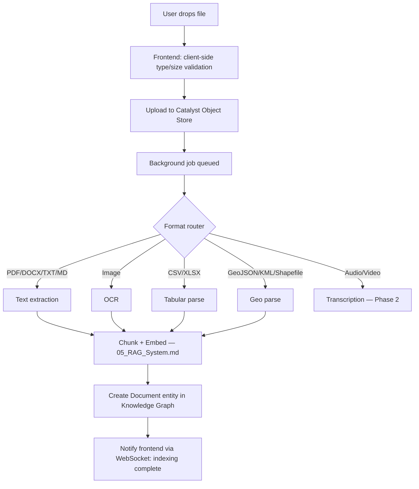
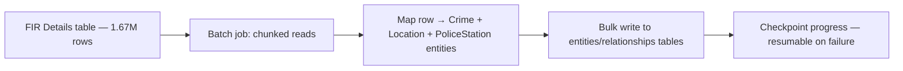

# 06 — Data Ingestion

**Depends on:** `00_Vision.md`, `04_Knowledge_Graph.md` §6 (v1 dataset migration), `05_RAG_System.md` §3

---

## 1. Two Distinct Ingestion Paths

It's important these aren't conflated, because they have very different performance/correctness requirements:

1. **Case file uploads** — a user drags a file into a Case. Needs to feel instant (streamed progress), happens continuously, arbitrary formats, arbitrary size.
2. **v1 dataset migration** — one-time batch job converting existing flat tables (FIR, transactions, CDRs, census) into graph entities. Happens once per dataset, can be slow, must be resumable/idempotent.

## 2. Case File Upload Pipeline

### 2.1 Required Behaviors

- Upload progress is shown immediately (object store write); **indexing** progress is shown separately and streamed (per `02_UI_UX.md` §5 — these are different stages and the UI must not conflate "uploaded" with "searchable")
- Failed extraction (e.g. corrupted PDF, unsupported sub-format) fails gracefully: the file remains attached to the Case as a raw artifact, flagged "not indexed," rather than silently disappearing or blocking the whole upload
- Large files are processed as background jobs (Catalyst's job/cron capabilities — see `08_Catalyst_Architecture.md`), never blocking the upload request itself

### 2.2 OCR

- Phase 0–1: route through whichever provider is added for vision/OCR in `07_API_Integrations.md` (not yet present in v1 — flagged there as a gap to fill)
- OCR output retains bounding-box metadata where the provider supports it, to support the image citation format in `05_RAG_System.md` §4

## 3. File Type Support Matrix

| Format | Phase | Extraction method |
|---|---|---|
| PDF | 0 | Existing v1 method (carried forward) |
| DOCX | 0 | docx text extraction |
| TXT / MD | 0 | Direct read |
| CSV / XLSX | 0 | Tabular parse, row-level chunking |
| JSON / XML | 1 | Structured parse |
| GeoJSON / KML | 1 | Geo feature parse, each feature → potential `Location` entity |
| Shapefile | 1 | Geo feature parse (requires a shapefile library — flag as new dependency) |
| Images (JPEG/PNG) | 1 | OCR + EXIF metadata extraction |
| Audio | 2 | Transcription (new provider needed) |
| Video | 2 | Transcription + frame sampling (new provider needed) |

## 4. v1 Dataset Migration (one-time batch job)

Per `04_Knowledge_Graph.md` §6, this converts existing flat tables into graph entities. This is **not** part of the live upload pipeline — it's a separate, run-once-per-environment migration script.

### 4.1 Requirements

- **Idempotent:** re-running the migration on an already-migrated dataset must not create duplicate entities (use deterministic entity IDs derived from source row keys, e.g. FIR number)
- **Resumable:** checkpoint progress (e.g. last processed row offset) so a failure partway through doesn't require restarting from zero — this matters given 1.67M+11M+ rows across datasets
- **Rate-aware writes:** bulk writes to Catalyst Data Store should batch (not one row = one write) to avoid hitting write-throughput limits
- **Does not modify v1 tables:** the original flat tables remain untouched and still serve `/api/v1/heatmap/grid`, `/api/v1/trends/timeseries`, etc. directly — this is a read-and-copy migration, not a cutover, satisfying non-negotiable #5 (v1 stays live)

### 4.2 Migration Order (dependency-aware)

1. Location/PoliceStation entities first (referenced by everything else)
2. Crime entities (FIR data) — links to Location/PoliceStation
3. BankAccount entities + financial relationships
4. Phone entities + CDR relationships
5. Census/SHRUG data attached as Location properties (not new entities)

## 5. Phased Rollout

- **Phase 0:** Case file upload for PDF/DOCX/TXT/MD/CSV; no v1 migration yet
- **Phase 1:** GeoJSON/KML/Shapefile/image support; v1 dataset migration job built and run against staging
- **Phase 2:** Audio/video; v1 migration run against production; incremental re-sync if v1 tables receive new data
