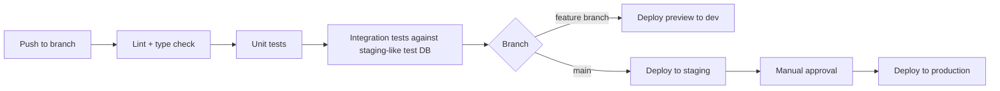

# 10 — Deployment

**Depends on:** `01_System_Architecture.md` §6 (environments), `07_API_Integrations.md` §1 (secrets policy), `08_Catalyst_Architecture.md`

---

## 1. Environments (extends v1)

v1 currently deploys to a single Catalyst Development environment (per the README: `CATALYST_ENVIRONMENT=Development`, live demo URL on a `development.catalystserverless.in` subdomain). v2 introduces a proper three-stage pipeline:

| Environment | Purpose | Notes |
|---|---|---|
| `development` | Active dev, matches v1's current setup | Existing |
| `staging` | New in v2 — validates migrations (esp. the v1 dataset batch migration, `06_Data_Ingestion.md` §4) and new provider integrations before they touch production data | Provision as a new Catalyst project stage |
| `production` | Live platform | New in v2 — v1's "live demo" link is effectively a dev environment serving as production today; formalizing a real production stage is a Phase 0 task, not a later nicety |

## 2. CI/CD

- Frontend: `npm run build` → deploy static build (matches v1's existing `catalyst deploy` flow)
- Backend: AppSail container deploy per environment
- Migrations (schema changes, the v1 dataset batch job) run as a distinct, explicitly-triggered step — never automatically on every deploy, given the scale and one-time nature of the batch migration (`06_Data_Ingestion.md` §4)

## 3. Secrets — Operational Detail

Per `07_API_Integrations.md` §1, this section covers *where* real values actually live:

| Environment | Secret storage |
|---|---|
| Local dev | `.env` file, gitignored, populated by each developer individually from their own provider accounts or a shared password manager — never committed, never pasted into a chat/AI tool |
| `staging` / `production` | Catalyst's environment variable / secrets configuration for the relevant AppSail deployment — confirm exact mechanism against current Catalyst docs (`08_Catalyst_Architecture.md` §3) |

**Key rotation policy:** any key that has ever been exposed outside of these two storage locations (pasted in a doc, a Slack message, a prompt to an AI tool, a public repo) is rotated immediately at the provider, not just removed from wherever it was exposed.

## 4. Monitoring

| Concern | Approach |
|---|---|
| Provider health | Admin screen polls each provider's `health()` (`07_API_Integrations.md` §2), surfaces circuit-breaker state |
| API error rates | Structured logging on every `/api/v2/*` route, aggregated per environment |
| Background job failures | Job status visible in Admin screen; failed indexing jobs retry with backoff, then surface as "needs attention" rather than silently failing |
| Cost/quota tracking | Especially for Google Maps (the one paid-beyond-free-tier provider flagged in `07_API_Integrations.md` §4) — usage dashboard or alert before hitting billing thresholds |

## 5. Rollback

- Frontend: previous build artifact redeploy (standard static rollback)
- Backend: previous AppSail container version redeploy
- Data: the v1 dataset migration (`06_Data_Ingestion.md` §4) writes only to *new* v2 graph tables, never mutating v1's original flat tables — so a bad migration run is recoverable by truncating the new tables and re-running, without any risk to v1's existing data or endpoints

## 6. Phased Rollout

- **Phase 0:** Formalize `staging`/`production` as real Catalyst stages; basic CI (lint, test, deploy to dev)
- **Phase 1:** Full CI/CD pipeline with staging gate; provider health monitoring on Admin screen
- **Phase 2:** Cost/quota alerting, rollback automation, broader observability
